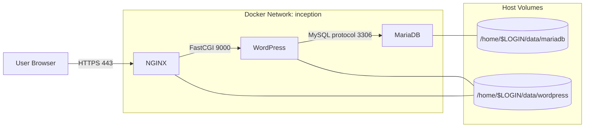

*This project has been created as part of the 42 curriculum by vsoulas*

# Inception 
## Description

Inception is a 42 system administration project built around Docker. The goal is to create a small but complete web infrastructure made of isolated services that communicate through a dedicated Docker network.

This repository provides three custom containers:

- NGINX as the HTTPS reverse proxy
- WordPress running with PHP-FPM
- MariaDB as the database server

Each service is built from its own Dockerfile, started with Docker Compose, and connected through persistent volumes so the stack can be rebuilt without losing data.

## Project Architecture



## Design Choices

- Debian bookworm is used as the base image for every service to keep the environment predictable.
- NGINX terminates HTTPS and forwards PHP requests to WordPress over the internal Docker network.
- WordPress runs with PHP-FPM instead of a full web server so NGINX remains the only public-facing service.
- MariaDB stores its data in a bind-mounted host directory so database files survive container recreation.
- WordPress files are also stored in a bind-mounted volume so the CMS state remains persistent.
- Each container has a single responsibility and its own startup script, which keeps boot logic isolated and easier to debug.

## Instructions

Before running the project, install:

- Docker
- Docker Compose
- Make

Create and fill in the `.env` file with the project credentials and domain name.

Add the local domain to your hosts file:

```text
127.0.0.1 <your_domain>
```

## Usage

Build all images:
make build

Start the stack:
make up

Or start it detached:
make upd

Open the website in your browser with HTTPS:

```text
https://<your_domain>
```

Useful commands:

- `make ps` to list running containers
- `make logs` to follow all logs
- `make logs-mariadb`, `make logs-wordpress`, `make logs-nginx` for service logs
- `make bash-mariadb`, `make bash-wordpress`, `make bash-nginx` for shell access
- `make stop` to stop the stack
- `make start` to restart stopped containers
- `make down` to remove containers and the network
- `make clean` to remove containers and volumes
- `make fclean` to remove containers, volumes, images, and stored data

## Docker Concepts

### VM vs Docker

A virtual machine emulates an entire operating system, while Docker shares the host kernel and isolates applications in containers. Docker is lighter, faster to start, and easier to rebuild for this kind of service-based project.

### Secrets vs Environment Variables

Secrets are designed for sensitive data management in orchestrated environments. This project uses environment variables from `.env` because the scope is smaller and the assignment expects simple container configuration.

### Docker Network vs Host Network

The services communicate through the internal `inception` Docker network instead of the host network. This keeps the containers isolated and allows them to reach each other by service name.

### Volumes vs Bind Mounts

Volumes store persistent data outside the container filesystem. In this project, bind mounts point MariaDB and WordPress data to directories under `/home/$LOGIN/data`, so the data survives rebuilds and can be inspected easily.

## Resources

- Docker documentation: https://docs.docker.com/
- Docker Compose documentation: https://docs.docker.com/compose/
- Docker Hub: https://hub.docker.com/
- NGINX documentation: https://nginx.org/en/docs/
- MariaDB documentation: https://mariadb.com/kb/en/documentation/
- WordPress documentation: https://wordpress.org/documentation/
- https://www.youtube.com/watch?v=pg19Z8LL06w

## AI Usage

AI assistance was used to help structure and rewrite the documentation from the existing project files and setup, as well as debugging during the project creation.